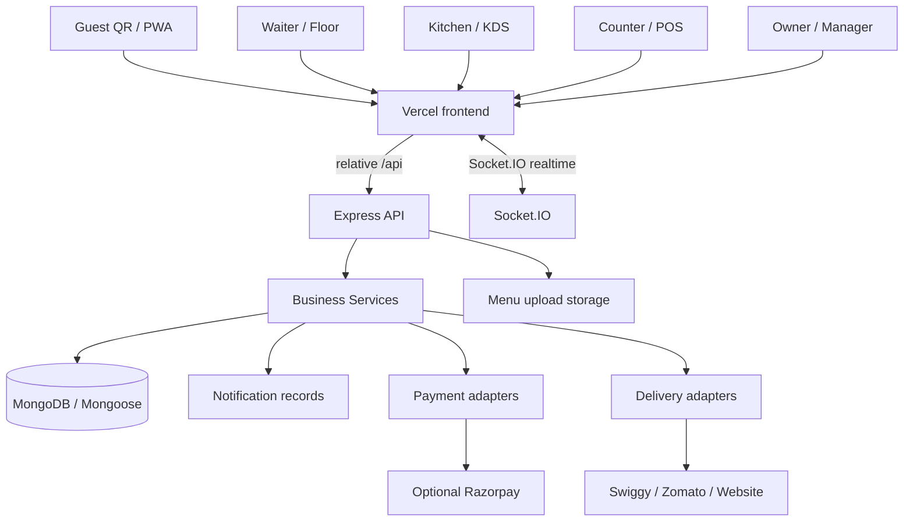

# Sizzle - System Design & System Map

**Repository:** `aniruddhasali800-pixel/ai`
**Baseline:** `main` / commit `bbfa7bb`
**Documentation date:** 4 October 2026

This document is the compact architecture map from the engineering handbook. The current repository code is authoritative if implementation and documentation differ.

## Architecture map



## Deployed topology

- Browser/PWA serves from the customer-facing Vercel domain.
- Vercel serves static assets and rewrites `/api/*`, `/uploads/*`, and `/socket.io/*` to the Render backend.
- Render runs Express, Socket.IO and the current embedded MongoDB demo.
- Real-use deployment is designed around `MONGODB_URI` for a real cluster and object storage for uploads.
- Realtime through the Vercel-rewritten domain uses Socket.IO HTTP long polling; a direct backend connection can upgrade when supported.

## Request lifecycle

1. Request reaches an Express router.
2. Authentication verifies the access JWT and re-reads the user.
3. RBAC resolves permissions at request time.
4. Zod validates body, query and params.
5. The handler calls the relevant business service.
6. The service applies domain rules and writes authoritative MongoDB rows.
7. Important writes emit Socket.IO events and persist notifications where the existing pattern requires them.
8. The frontend invalidates the affected query key and refetches the REST resource.

## Core state machines

**Order:** `PLACED -> ACCEPTED -> PREPARING -> READY -> SERVED -> COMPLETED`

**Table:** `AVAILABLE -> RESERVED -> OCCUPIED -> ORDERING -> FOOD_READY -> BILL_REQUESTED -> PAYMENT_PENDING -> CLEANING -> AVAILABLE`

## Non-negotiable rules

- Server computes totals; client totals are ignored.
- Authenticated queries are tenant-scoped by `restaurantId`.
- Status changes use the declared state machine and role permissions.
- Recipe stock is deducted once at first `PREPARING`.
- Early punches on one table session are serialized and merged while the current order is `PLACED` or `ACCEPTED`.
- Waiter assignment is informational; every waiter can operate every table.
- Payment is never marked successful from a client assertion.
- Public QR codes use a customer-reachable public host.
- Business rules stay in services rather than route handlers.

## Realtime pattern

```text
Mongo write
   |
   +--> emit.ts --> room event
   |
   +--> notification.service.ts --> durable Notification row
                                    |
Browser socket.ts <-----------------+
   |
   +--> useRealtimeShell.ts
             |
             +--> invalidate(query key)
                         |
                         +--> REST refetch
                                   |
                                   +--> UI rerender / toast / badge
```

The socket payload is a change signal, not the canonical dataset.
